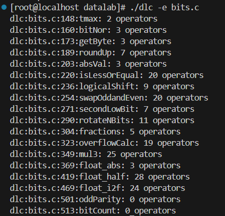
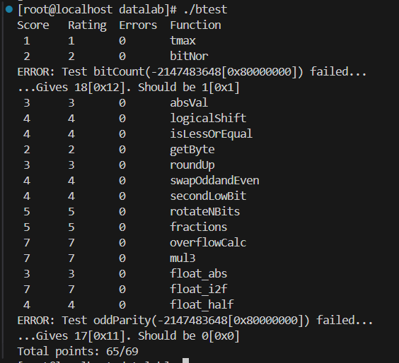

# Datalab Report
***23307130417 梁灿***
### 运行`./dlc -e bits.c`结果

### 运行`./btest`结果

### P1:tmax
* 题目要求：输出32位有符号整数可以表示的最大正整数

由于最高位是符号位，故可表示的最大正整数为`0x7fffffff`。先将1进行右移操作得到`0x80000000`，再对其取反即可得到结果。

```
int tmax(void) {
  return ~(1<<31);
}
```

### P2:bitNor
* 题目要求：用 ~ 和 & 运算符实现~(x|y)

根据德摩根定律：非（p或q）=非p且非q。

```
int bitNor(int x, int y) {
	return ~x&~y;
}
```

### P3:getByte
* 题目要求：返回指定字节的数据
* 核心思路：将指定字节右移至首个字节位置，再用掩码`0xff`提取数据
由于一个字节共八位，故应该右移8n位，通过`n<<3`实现乘法。
```
int getByte(int x,int n) {
  return (x>>(n<<3))&0xff;
}
```
### P4:roundUp
* 题目要求：将x约等为不小于x且最接近x的256的倍数
* 核心思路：先找到不大于x且最接近x的256的倍数。若低位不为0，则需要再加256。
```
int roundUp(int x) {
    int remainder = x & 0xFF; //通过掩码获取低位数据            
    int extra=!!remainder;//将低位数据转换为布尔变量
    int prev=x&(~0xff); //找到不大于x且最接近x的256的倍数
    int result=prev+(extra<<8); //利用右移操作构造256
    return result;                     
}
```

### P5:absVal
* 题目要求：返回x的绝对值
* 核心思路：先判断符号。
  * 当符号位为0时，得到的掩码为全0。根据异或的性质：和全0进行异或操作得到原数，返回原值。
  * 当符号位位1时，得到的掩码为全1。根据异或的性质，和全1进行异或操作相当于取反，而0xffffffff表示的数为-1，此时完成了先减1后取反，返回负数的原码。

```
int absVal(int x){
  int sign=x>>31; //通过右移操作判断符号
  return (x+sign)^sign;
}
```

### P6:isLessOrEqual
* 题目要求：当x<=y时返回1，其余情况返回0.
* 核心思路：考虑一下几种情况，并用与运算连接。（只要满足其中一种即返回1）
  * 只有xy同号时，可以用x-y的正负判断大小：`devsign&(!(signx^signy))`
  * 当xy异号时，x-y存在溢出的可能性。故此时直接考虑唯一的情况：x
  非正：`(signx&(signx^signy))`
  * x=y情况额外处理：当x-y结果为0时，返回1：`!dev`

```
int isLessOrEqual(int x, int y) {tonghaoshi
  int signx=!!(x>>31); //取x符号且将其转换为布尔变量（非负为0，负为1）
  int signy=!!(y>>31);//取y符号并将其转换为布尔变量
  int dev=x+(~y+1);//计算x-y
  int devsign=!!(dev>>31);//取（x-y）符号并将其转换为布尔变量
  int result=(devsign&(!(signx^signy)))|(signx&(signx^signy))|(!dev);
  return result;
}
```
### P7:logicalShift
* 题目要求：实现逻辑右移，即对于所有数右移时均补充0。
* 核心思路：构造一个高n位为0，其余位为1的掩码，与原数进行与运算，保留右移后数据。
* 注：实践中发现，如果仅仅通过将1左移（32-n）位再与（~0）相加构造掩码，当n=0时会出现溢出的情况，导致获得的掩码全为0不符合要求。为了避免该情况，可以在左移时少移一位，以确保n=0时不会溢出。在完成加法操作后，再左移一位并加1，确保最低位为1。
```
int logicalShift(int x, int n) {
  int shift=x>>n;
  int mask=(1<<(32+(~n)))+(~0);
  mask=(mask<<1)+1;
  return shift&mask;
}
```
### P8:swapOddandEven
* 题目要求：交换偶数位与奇数位。
* 核心思路：分别用掩码0x55555555、0xAAAAAAAA保留原数的奇数位与偶数位，再将偶数位右移、奇数位左移，得到新的奇数位与偶数位，再进行或运算得到结果。
* 注：
  1. 由于在实验中只能使用0x0~0xff范围内的常数，故奇偶掩码需要通过左移操作以及或运算构造
  2. 当符号位为1时，偶数位右移后首位会为1，导致结果错误。故需要额外构造掩码，确保偶数位右移得到的新奇数位首位为0，能够正确进行与运算。
```
int swapOddandEven(int x) {
  int oddmask=0x55|(0x55<<8)|(0x55<<16)|(0x55<<24); //分别构造奇偶掩码
  int evenmask=0xAA|(0xAA<<8)|(0xAA<<16)|(0xAA<<24);
  int odd=(x&oddmask)<<1; //分别左移、右移
  int even=(x&evenmask)>>1;
  int mask=~(1<<31); //构造掩码使首位为0
  even=even&mask;
  return odd|even;
}
```

### P9:secondLowBit
* 题目要求：返回标记了第二个1的位置的掩码
* 核心思路：先找到第一个1的位置，利用该掩码将第一个1变为0，再用同样方法，返回的掩码即为第二个1的位置。
```
int secondLowBit(int x) {
  int last=x&(~x+1); //获取标记了首个1位置的掩码
  int nolast=last^x; //将第一个1归0，此时nolast中首个1的位置即为原数第二个1的位置
  int result=nolast&(~nolast+1);//返回标记了nolast中首个1位置的掩码
  return result;
}
```

### P10:rotateNbits
* 题目要求：将高n位放到原数末尾
* 核心思路：将无需rotate的数据左移n位至最高位，将需要rotate的数据右移（32-n）位，通过或运算拼接两部分数据。
* 注：
  1. 在测试时发现所给的n存在超出32的情况，故增加一步取余数获取实际需要移动的位数。
  2. 需要额外为rotate数据构造掩码以确保其高位为0.
```
int rotateNBits(int x, int n) {
  int opn=n&31; //取余数作为实际操作位数
  int high=x<<opn; //移动原数据至高位
  int rotate=x>>(32+(~opn)+1); //移动需要rotate数据至低位
  int mask=(1<<opn)+(~0); //构造掩码确保rotate高位为0
  int low=rotate&mask;
  int result=high|low;
  return result;
}
```

### P11:fractions
* 题目要求：实现计算`x*7/16`
* 核心思路：通过右移实现除法，左移实现乘法.
* 注：左移n位相当于乘以2的n次方，而7并不是2的次方。故`x*7`通过`x*8-x`实现。
```
int fractions(int x) {
  int multi=(x<<3)+(~x)+1;
  int result=multi>>4;
  return result;
}
```

### P12:overflowCalc
* 题目要求：给定三个整数，返回三个整数相加结果中溢出32位部分
* 核心思路：通过模拟进位，确定发生进位的数位。
考虑到只有最高位发生进位会导致溢出，再通过右移31位舍去溢出无关的位数。
进位有两种情况：
  * x和y同一位均为1：通过`x&y`记录
  * x和y在某一位其中一个为1，但有后方进位：通过`x|y`记录所有为1的位置，再记录原本为1但是和中为0的位置，即为发生进位的位置。整个实现为：`(x | y) & ~sum1`
* 注：
  1. 由于每一次运算都有溢出可能，需要分别对两次加法过程进行溢出判断
  2. 为了避免右移时补充1位的影响，需要将进位转换为布尔变量
```
int overflowCalc(int x, int y, int z) {

  int sum1 = x + y;
  int carry1 =!!( ((x & y) | ((x | y) & ~sum1)) >> 31);
  int sum2 = sum1 + z;
  int carry2 =!!( ((sum1 & z) | ((sum1 | z) & ~sum2)) >> 31);
  return carry1 + carry2;
}
```

### P13:mul3
* 题目要求：计算x*3，若不溢出则返回计算结果；若向上溢出则返回最大整数，向下溢出则返回最小整数。
* 核心思路：考虑以下两种情况
  * 若x为正数，计算结果为负数，意味着向上溢出。
  * 若x为负数，计算结果为整数，意味着向下溢出。
* 返回结果采用的思路：
  * 通过`pos_overflow`和`neg_overflow`作为掩码标记溢出，若溢出则为全1，否则为全0。
  * 同时通过`(~(pos_overflow | neg_overflow))&result`,确保发生溢出时，原有的结果不会对返回值造成影响。
* 注：
  1. x*3通过x+x+x实现，故当x极大或极小时可能在第一次加法时便出现溢出。因此每做一次加法都要判断一次溢出。

```
int mul3(int x) {
  int INT_MAX=~(1<<31);
  int INT_MIN=1<<31;
  int mid_result=x+x;
  int result=mid_result+x;
  
  int signx=x>>31; //获取x以及每个加法结果的符号
  int sign_result=result>>31; 
  int sign_midresult=mid_result>>31;
  
  int pos_overflow=((~signx)&sign_midresult)|((~signx)&sign_result); //判断是否溢出
  int neg_overflow=(signx&(~sign_midresult)) | (signx& (~sign_result));

  result=(pos_overflow&INT_MAX) | (neg_overflow&INT_MIN) |((~(pos_overflow | neg_overflow))&result);
  return result;
}
```

### P14:float_abs
* 题目要求：返回所给无符号整数表示的浮点数的绝对值。若所给的无符号整数对应的是NAN，则返回原值。
* 核心思路：先判断所给无符号整数是否是NAN，再利用首位为0其余位均为1的掩码`0x7FFFFFFF`将符号位改为0.

```
unsigned float_abs(unsigned uf) {
  if((uf &0x7FFFFFFF)>0x7F800000)  //检查所给无符号整数是否对应NAN
  {
    return uf;
  } 
  return uf&0x7FFFFFFF; //利用掩码将符号位修改为0
}
```
### P15:float_half
* 题目要求：返回所给无符号整数所表示的浮点数除以二后的结果。
* 核心思路：分别考虑一下几种情况
  * exp=255，即对应NaN和无穷大两种情况，此时应直接返回原数。
  * exp=0，即对应次正规数，此时应直接将frac右移一位。
  * exp=1，作除法后会从正规数变为非正规数。此时需要为frac补上隐含的“1”再进行右移操作。
  * 除以上情况外的其他情况，直接将exp减1即可。
* 注：当exp=0或exp=1时还存在舍入问题，舍入规则为最近偶数舍入：当尾数最后一位为1，且操作后结果仍为奇数时，需要向前进位，即frac+1.
```
unsigned float_half(unsigned f) { 
  unsigned sign=f&0x80000000; //提取符号位
  unsigned exp=((f&0x7F800000)>>23)&0xff; //提取指数位
  unsigned frac=f&0x007FFFFF; //提取尾数
  unsigned round_bit=frac&1; //提取最后一位，以判断是否需要舍入
  if((f==0x80000000)|| exp==255) //处理NaN、无穷大及负0情况
  {
    return f;
  }
  if (exp==0) 
  {
    frac=(frac>>1);
    if(!frac) //处理离0较近的情况：无需舍入直接返回正0/负0
    {
      return sign|frac;
    }
    if(round_bit && (frac & 1)) //最近偶数舍入
    {
      frac++;
    }
  }
  else if(exp==1)
  {
    frac=(f&0x007FFFFF)|0x00800000; //补上隐含的1后进行右移
    frac>>=1;
    if(round_bit && (frac & 1)) //最近偶数舍入
    {
      frac++;
    }
    return sign|frac;
  }
  else
  {
    exp--; //其余情况直接使指数减1
  }
  return sign|(exp<<23)|frac; //拼接符号位、指数位与尾数得到最后结果
}
```

### P16:float_i2f
* 题目要求：将所给的整数用浮点数形式表示
* 核心思路：依次提取sign、exp、frac各项然后拼接
  * sign：判断原数正负。分别给符号位赋值。并且对于负数，需要取其绝对值。
  * exp：通过找到最高位的1所在的位置，再将该位置加上127确定指数。
  * frac：通过左移丢弃最高位，再右移并利用掩码提取尾数。
* 注：
  1. 0作为特例需要额外处理
  2. 舍入处理：当所给整数超过23位时需要进行舍入，原则是就近舍入。

```
unsigned float_i2f(int x) {
  unsigned sign,exp,frac;
  unsigned abs=x;
  int shift=31;
  if(x==0) //判断正负，给符号位赋值
  {
    return 0x0;
  }
  if(x<0)
  {
    sign=1<<31;
    abs=-x;
  }
  else
  {
    sign=0;
  }

  while((abs&(1<<shift))==0) //通过遍历的方法找到原数中最高位的1所在位置
  {
    shift--;
  }
  exp=(shift+127)<<23; //确定指数项
  abs=abs<<(31-shift); //左移丢弃最高位
  frac=(abs>>8)& 0x7fffff; //右移，并利用掩码规避右移时可能产生的1，得到尾数

  if(abs&0x80) //判断是否需要进行舍入
  {
    if((abs&0x7f)||(frac&1)) //被舍去的位数大于一半，或被舍去位数等于一半时位数为奇，则需要向上舍入
    {
      frac++;
    }
    if(frac>>23) //若舍入后尾数超过23位，将尾数至0，指数加1
    {
      frac=0;
      exp=exp+(1<<23);
    }
  }
  return sign|exp|frac; //拼接结果
}
```

### P17:oddParity

### P18:bitCount

*部分代码参考chatgpt，特此注明。*