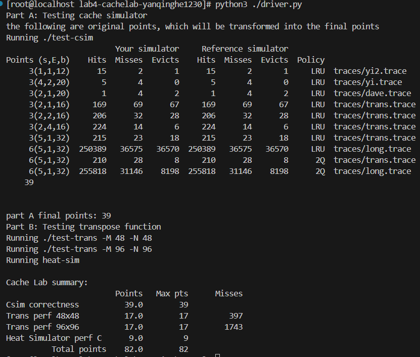
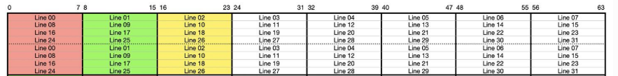
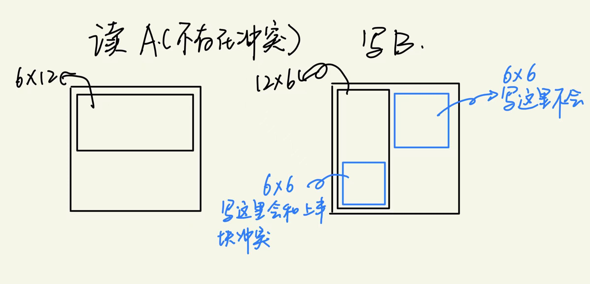
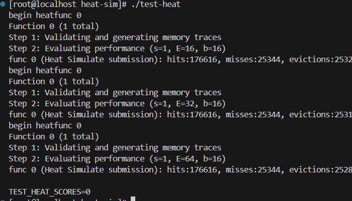
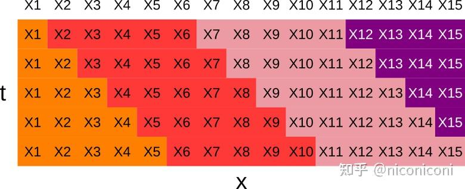
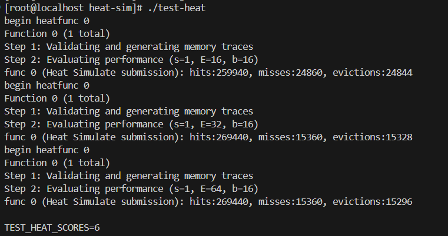
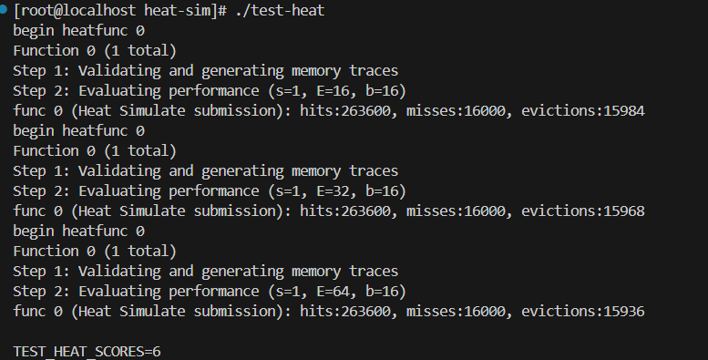
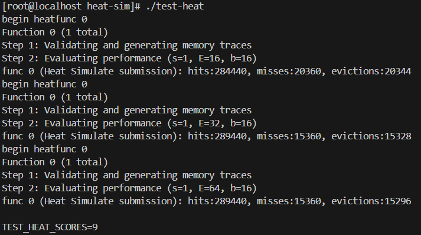

# Cachelab

## 结果

## PARTA
### 数据读取
考虑到trace文件的格式固定，所以采用`fscanf(file," %c %lx,%d\n",&operation,&address,&size)`读取每一行的操作。需要注意的是，地址均用十六进制表示，且存在大于4字节的情况，故需要用`%lx`读取地址。
### Cache基本结构
每次进行cache select的过程是：先根据setindex找到对应的set，再在相应的set中依次匹配tag值，若匹配到则为一次hit。
因此在每一个cacheline中只需要存储tag值，以及为了进行LRU替换需要用到的`last_visited_time`(虽然为了和书上cache的实现相同，还存储了`valid`，但在实现中并没有用到。)
而set就是以line为元素的数组，cache是以set为元素的数组。故这些基本结构定义为：
```cpp
typedef struct
{
    int valid;
    int tag;
    int last_visited_time;
}line;
typedef line* set;
set* cache;
```

接下来需要思考的是如何根据地址计算setindex和tag。由于lab中的S、E、B均存在不是2的幂次的情况，故不能根据书上进行位移的方法得到相应值。位移本质是触发，故可以效仿这种思想进行相应的整除或模运算。
* **setindex的计算**
原setindex的计算是通过右移s个bits，再构造掩码排除tag的影响得到index。相对应的，用address先除以blockSize，再对numSet取余，得到的余数就是setindex。
* **tag的计算**
原tag的计算是通过右移`s+b`个bits，得到tag。相对应的，用address除以(blockSize*numSet)，其整数部分就是tag。
### LRU策略模拟
在计算出setindex和tag后，通过指定下标的方式找到对应的set：
`set cset=cache[setindex];`
然后遍历set，依次匹配tag，若匹配成功则hit次数加1，并将该cacheline的`last_visted_time`更新为当前的时间。在这个遍历的过程中，同时进行最久访问时间的更新(用变量`lru_time`记录该时间，`lru_pos`记录对应的set)。
若匹配失败，且当前set的cacheline已满，则需要执行eviction(替换最久未访问的cacheline的tag，并更新时间)。

需要注意的是：
* **如何判断set的cacheline已满**

在初始化cache时，每一个cacheline的`last_visted_time`均被初始化为-1。若set中存在空line，则在遍历时会被记录下来。故只需要在确定miss之后判断：`lru_time==-1`，若满足，说明有空余line，该line会在后续被更新(和eviction的操作相同)：
```cpp
cset[lru_pos].last_visited_time=timecount;
cset[lru_pos].tag=tag;
```

* **如何处理M操作**

M操作需要两次访问缓存，一次读一次写。故如果第一次访问时成功hit，第二次一定也回hit；如果第一次访问时miss，第二次访问时由于已经写入cache，所以也会hit。故只要在调用simulate函数时，同时传递一个参数标识该操作是否为M，若该参数为1，则在原基础上增加一次hit。

### 2Q策略模拟
**数据结构设计**
2Q策略的cache结构与lru有所不同，它的每一个set中有两个队列：A1-in和Am。故用新定义结构类型：setnode，其中存储指向两个队列的指针。cache即为一个以setnode为元素的数组。
此外，为了便于操作，还在queue.h中定义了其他函数：

* `int find_and_update(Queue *q,int tag,int timecount)`：用于在Am队列中更新匹配成功的数据的时间，搜索并更新成功返回1，失败返回0。

* `void lru_replace(Queue *q,int tag,int timecount)`: 用于在Am队列中进行LRU替换。

**模拟实现**
1. 调用`find_and_update`函数，搜索Am队列，若搜索成功，则hit次数加一并返回主函数
2. 调用`find_and_remove`函数，搜索A1-in队列，若搜索失败，则是一次完全未命中，miss次数加一。接着判断队列是否已满，若未满则直接入队，已满则先出队后入队。
3. 若搜索且移除成功，仍然视作一次未命中，miss次数加一。接着判断Am队列是否已满，若未满则直接入队，若已满则调用`lru_replace`函数进行LRU替换，同时eviction次数加一。

需要注意的是，M操作仍然需要额外讨论：
1. 若完全未命中，则第一次访问后会将该数据放入A1-in，第二次访问会将该数据提升至Am，仍然是两次miss。但是需要额外判断此时Am队列是否已满，若队列已满，则还需要记一次eviction。
2. 若在A1-in队列中命中，则会在第一次访问后将该数据提升到Am队列，第二次访问一定命中，记一次miss和一次hit。
3. 若在Am队列中命中，记两次hit。

***问题：相对于LRU的替换策略，为什么2Q有以上优点却没有被大规模使用***
1. 相较于LRU，2Q的操作复杂度更高，同样一次访问操作时间复杂度更大，使访问速度变慢。
2. 2Q的性能与两个队列的大小分配强相关，同一比例可能不能适应不同的工作负载。
3. 2Q需要维护两个队列，占用更多内存。

## PARTB
缓存参数为：`s = 48, E = 1, b = 48`。矩阵中每一个元素都是int类型，而一个int类型用4个字节存储，故缓存中总共可以放下`48*12=576`个int，一个set中可以存储12个int。
### 48*48
先考虑最朴素的转置方法,结果为：`hits:2070, misses:2543, evictions:2495`
这是因为A、B大小相同，且初始地址映射的块相同(初始地址是48的整数倍)。但仍然出现了相当程度上的命中，因此需要仔细考虑什么时候会不命中。

读元素`A[i][j]`，需要写元素`B[j][i]`，两个数据存储地址相对于数组起始地址的偏移量（按int数计算），及对应储存的set为：
`A[i][j]：i*48+j`，存储在第`(i*4+j/12)%48`个set中，这个set中存储着从`A[i][j/12]`开始的12个int
`B[j][i]: j*48+i`，存储在第`(j*4+i/12)%48`个set中，这个set中存储着从`B[j][i/12]`开始的12个int
可以发现，当i==j的时候，两个数据所属set才会发生冲突。

在读取A时，由于采用了行优先的读取方式，故每12个数，只有第一次加载时才会发生miss；而在写入B时，由于写入方式实际上是列优先，但矩阵存储方式是行优先，故每次写同一行相邻的两个元素时(eg:`B[j][0]和B[j][1]`)，一定先写完了一整列，共加载了`48*12`个数到缓存中，`B[j][0]`所属的set恰好被覆盖，因此一定会miss。

为了利用B的局部性，采用以下策略：将`48*48`的矩阵分成`12*12`的小块，先进行块转置，再进行块内转置。
每一个块操作中，一次性读入12个A中的元素(属于同一个set)，然后连续写入B中块转置后的对应行。在完成B的写入后，再进行块内转置。这样最后转置时B的整块都加载在缓存中，一定可以hit。
（如果先全部转置后写入，读写对角线元素会发生冲突。eg：读`A[i][i]`时，需要写`B[i][i]`，而由前面的说明可知，这两个元素所属set会互相冲突，每次都需要互相驱逐再写入，导致多次miss）

同时，使用12个局部变量存储从A中读到的数据，以确保连续读写。
最后的miss次数为：397

### 96*96
如果直接应用以上方法，发现miss数仍然过多。这是因为现在每一行共有96个int，如果仍然采用`12*12`分块，上下半块会发生冲突：

>图片来自：https://zhuanlan.zhihu.com/p/387662272

(参考该图，在`96*96`的情况下，以六行为单位不发生冲突)
非常自然地可以想到，直接进行`6*6`的分块，但是这会因为分块过多，而每次进行新块的计算都大概会有(6+6)次miss（每次读A的新一行和写B的新一行），导致miss次数并不是最优。
如果采用`6*12`方法分块，情况如下图：


因此采用优化方法：先`12*12`分成大块，每个大块内再分成`6*6`的小块依次操作，具体操作方法如下(设`α[2][2]`和`β[2][2]`分别是A、B两矩阵两次分块得到的子矩阵)：
1. 将`α[0][0]`整体复制到`β[0][0]`，然后块内转置
2. 将`α[0][1]`整体复制到`β[1][0]`
3. 先用局部变量暂存`β[1][0]`中的内容，然后将`α[1][0]`整体复制到`β[1][0]`，再通过局部变量将暂存在`β[1][0]`中的内容放入`β[0][1]`，同时转置
4. 将`α[1][1]`整体复制到`β[1][1]`，然后块内转置

最终的miss次数为：1743。

## PARTC
由矩阵转置可以得到一个粗略的思路：对于需要操作的矩阵进行分块，块越大，同一时间需要被存在缓存里的数据越多，在cache不够大的情况下就容易出现频繁的内存访问；块越小，cache空间可能就无法充分利用。
因此目标是：找到一种合适的分块方式以及合适的分块大小。

***问题：miss随 cache setting 的变化情况。为什么会有这种情况？***

miss情况如下图所示：


发现miss次数并不随着cache的变大而减小，并维持在一个较高的水平。
这是因为每一行共有512个int数据，即使是缓存最大的setting也不能完整的存储。而在计算第i行的数据时需要利用第i-1行的数据，但中间已经间隔了一整行数据的计算，故原需要的数据已经被驱逐，需要重新访问内存，因此数据重复利用率低，因此miss次数不变化且较大。

> https://zhuanlan.zhihu.com/p/679005228
参考该文章，采用图中的分块方法：


此时平行四边形块的大小为25个int，即100字节，在每个块的计算中除了边缘部分需要读取上一块的部分数据，其余都只依赖块内数据，避免了重复的内存访问。
(在coding时有一个细节，由于第0行的数据是不需要计算的，因此遍历时所写的元素不是当前遍历的元素，而是上一行的对应元素，以确保每一块的最下面一行都是已知量)

测试结果如下图：


发现在cache较小的情况下miss数并不达标，说明当前分块略大。

于是减小平行四边形块到16个int，即64字节，结果如下：


发现分块过小，即使是最小的cache也可以完全缓存，但是对于较大的cache，则浪费了很多空间，并不达标。

于是最后修改平行四边形块大小为20个int(4*5)，即80字节，结果如下:


结束！
***参考***
> https://arthals.ink/blog/cache-lab
> https://zhuanlan.zhihu.com/p/387662272
> https://zhuanlan.zhihu.com/p/679005228